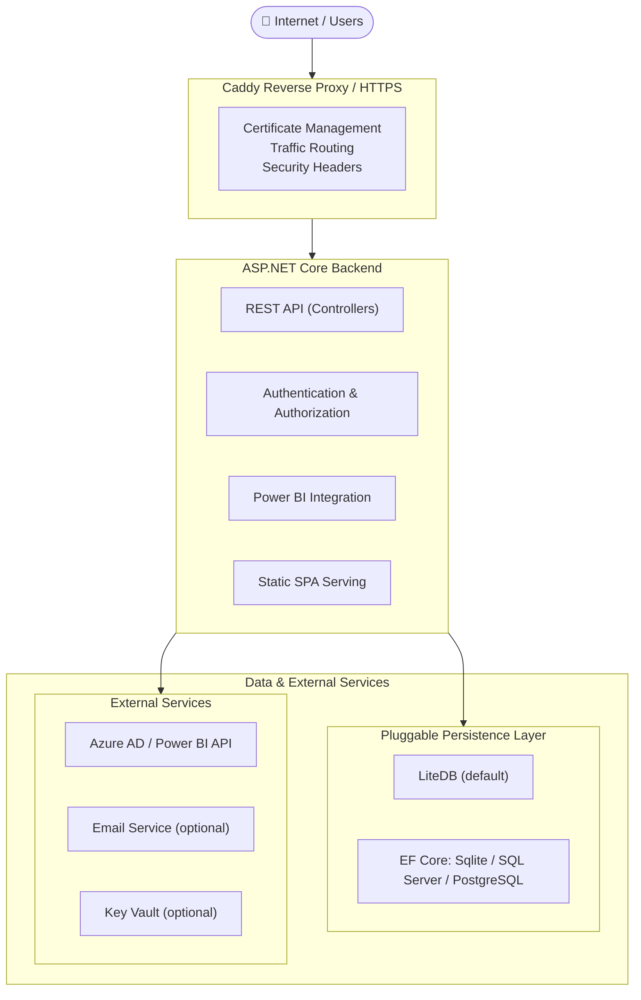
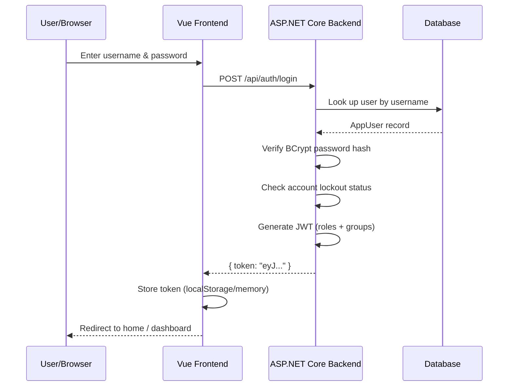
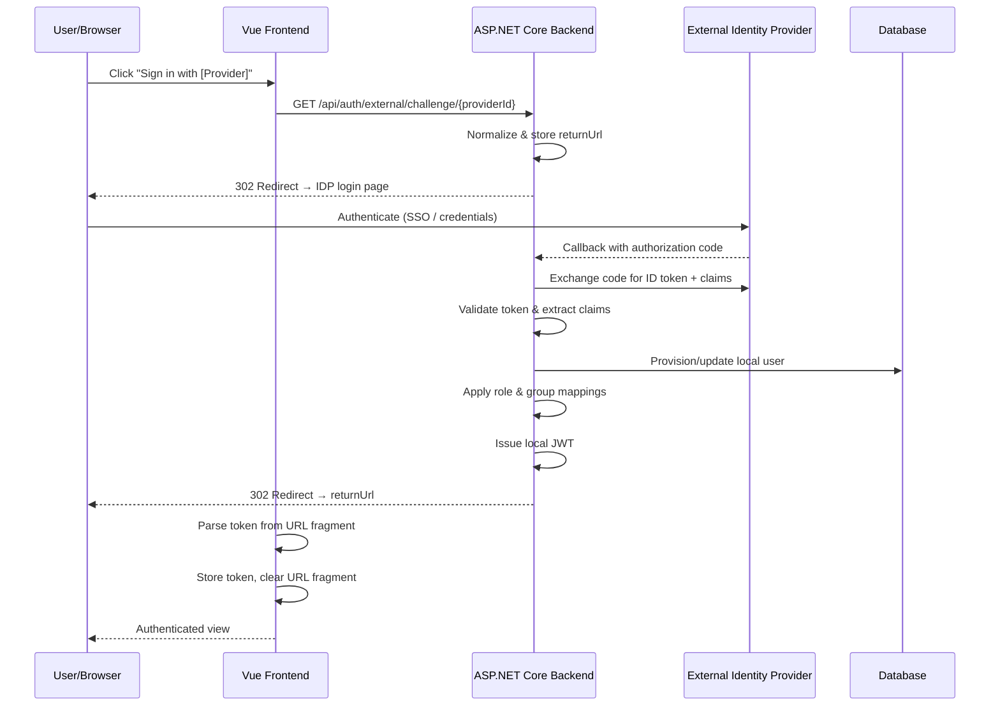
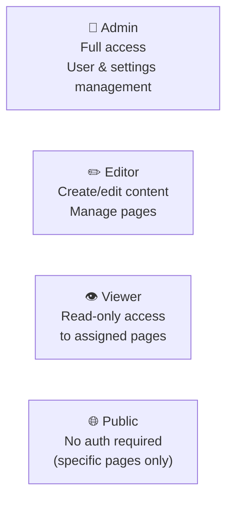
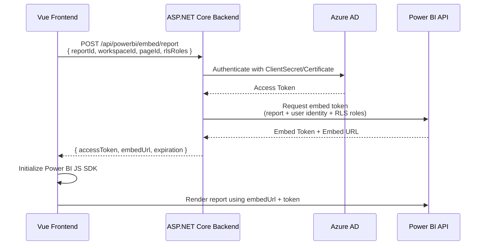
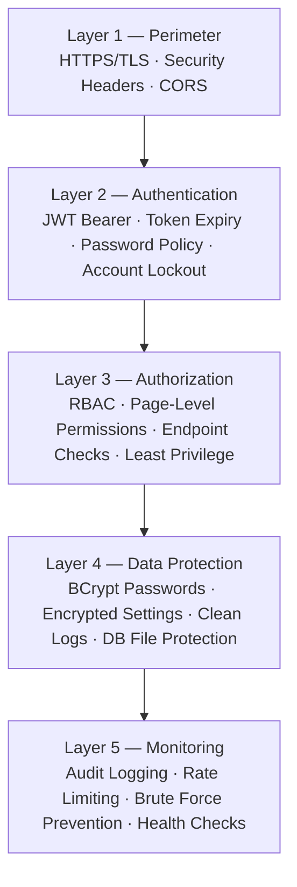
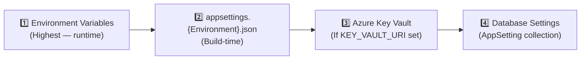

# Architecture Documentation

## System Overview

PBIHoster is an enterprise-grade Power BI hosting platform built with a modern, scalable architecture. The system follows a clear separation between the backend API, frontend SPA, and data persistence layers.



## Layered Architecture

### Presentation Layer

**Technology**: Vue 3 + TypeScript + Vite  
**Location**: `reporttree.client/`

- **Components**: Reusable Vue components using Composition API + `<script setup>`
- **Views**: Page containers for major routes
- **Stores**: Pinia for state management (authentication, theme, etc.)
- **Services**: HTTP clients for API communication
- **Composables**: Reusable logic hooks

### API Layer

**Technology**: ASP.NET Core (.NET 10) Web API  
**Location**: `ReportTree.Server/`

The API follows a hybrid pattern:
- **Minimal APIs** (Program.cs): Authentication endpoints (login, register, logout)
- **Controllers**: Resource-based endpoints (pages, users, reports, settings)
- **Middleware**: Cross-cutting concerns (auth, logging, rate limiting, CORS)

#### Request Middleware Pipeline

```mermaid
graph LR
    Req["Incoming Request"]
    FH["Forwarded Headers"]
    SH["Security Headers"]
    RL["Rate Limiting"]
    CORS["CORS"]
    JWT["JWT Authentication"]
    AZ["Authorization"]
    EP["Endpoint / Controller"]
    AL["Audit Logging"]
    Res["Response"]

    Req --> FH --> SH --> RL --> CORS --> JWT --> AZ --> EP --> AL --> Res
```



#### API Structure
```
/api/auth/           - Authentication (login, register, refresh; logout is client-side)
/api/pages/          - Page/content management
/api/users/          - User management and profiles
/api/admin/          - Admin operations (requires Admin role)
/api/settings/       - Application settings
/api/comments/       - Page comments and threaded replies
/api/themes/         - Theme management
/api/powerbi/        - Power BI integration
/api/refreshes/      - Dataset refresh management
/api/audit/          - Audit log queries and compliance exports
```

### Service Layer

**Purpose**: Business logic and external integrations

**Key Services**:
- **AuthService**: JWT generation, user authentication
- **OidcAuthService**: External provider discovery for login UX
- **ExternalAuthConfigurationService**: Merges config/env providers with admin-managed non-secret mapping overrides
- **ExternalGroupSyncService**: Maps external group claims to internal groups during external login
- **ExternalRoleMappingService**: Resolves internal roles from external claims with default-role fallback
- **TokenService**: JWT token operations
- **PageAuthorizationService**: Role-based access control for pages
- **PowerBIService**: Azure AD authentication and Power BI API calls
- **SettingsService**: Configuration management with encryption and governance feature toggles
- **AuditLogService**: Comprehensive logging of user actions
- **AuditExportService**: Filtered compliance exports for audit records in CSV and PDF formats
- **CommentsController + ICommentRepository**: Threaded comments with owner/admin moderation and page-access checks
- **PagesController + IPageVersionRepository**: Layout version history snapshots and rollback workflow
- **BrandingService**: Logo and custom theme management
- **RefreshSchedulerHostedService**: Background job scheduler for dataset refreshes

### Data Access Layer (Repository Pattern)

**Technology**: Repository Pattern with provider abstraction  
**Location**: `ReportTree.Server/Persistance/`

Runtime database provider selection is controlled through `Database:Provider`:
- `LiteDb` (default): existing LiteDB repositories.
- `Sqlite`, `SqlServer`, `PostgreSql`: EF Core repositories backed by `AppDbContext`.

For relational mode, collection/dictionary fields are persisted with JSON value converters to preserve existing model shapes without changing service contracts.

Branding binaries use `LocalFileBrandingAssetRepository` in relational mode and remain in LiteDB in embedded mode.

Each entity has a corresponding repository:
```csharp
IUserRepository      // AppUser operations
IPageRepository      // Page/content operations
ISettingRepository   // Settings operations
IAuditLogRepository  // Audit logging
IThemeRepository     // Custom themes
IGroupRepository     // User groups
ICommentRepository   // Page comments
IPageVersionRepository // Page layout version history
```

Provider-specific repository implementations:
- LiteDB: `LiteDb*Repository` classes.
- Relational: `Persistance/Relational/Ef*Repository` classes using `IDbContextFactory<AppDbContext>`.

### Data Model

#### Core Entities

**AppUser**
```csharp
public class AppUser
{
    public Guid Id { get; set; }
    public string Username { get; set; }
    public string Email { get; set; }
    public string? PasswordHash { get; set; }  // null for external users
    public List<string> Roles { get; set; }     // Admin, Editor, Viewer
    public List<Guid> FavoritePageIds { get; set; }
    public string? AuthProvider { get; set; }   // Local, AzureAd, Okta, etc.
    public string? ExternalUserId { get; set; }
    public DateTime CreatedAt { get; set; }
    public DateTime? LastLoginAt { get; set; }
    public bool IsLocked { get; set; }
}
```

**Page**
```csharp
public class Page
{
    public Guid Id { get; set; }
    public string Title { get; set; }
    public string? Description { get; set; }
    public string? Icon { get; set; }           // Carbon Design icon name
    public List<string> AllowedRoles { get; set; }
    public bool IsPublic { get; set; }
    public List<Guid> ChildPageIds { get; set; }
    public Guid? ParentPageId { get; set; }
    public PageLayout? Layout { get; set; }     // Drag-drop layout config
    public DateTime CreatedAt { get; set; }
    public DateTime UpdatedAt { get; set; }
    public Guid CreatedByUserId { get; set; }
}
```

**AppSetting**
```csharp
public class AppSetting
{
    public string Key { get; set; }
    public string Value { get; set; }           // Encrypted if sensitive
    public string Category { get; set; }        // General, Security, PowerBI, Email
    public string Description { get; set; }
    public DateTime UpdatedAt { get; set; }
    public Guid UpdatedByUserId { get; set; }
}
```

**AuditLog**
```csharp
public class AuditLog
{
    public Guid Id { get; set; }
    public string Action { get; set; }          // LOGIN, CREATE_PAGE, DELETE_USER, etc.
    public string Resource { get; set; }        // User, Page, Settings, etc.
    public string? ResourceId { get; set; }
    public Guid? UserId { get; set; }
    public string? IpAddress { get; set; }
    public bool Success { get; set; }
    public string? FailureReason { get; set; }
    public DateTime CreatedAt { get; set; }
}
```

**Additional Entities**: Group, Comment, PageVersion, BrandingAsset, CustomTheme, LoginAttempt, DatasetRefreshSchedule, DatasetRefreshRun

### Feature Toggles

- `App.DemoModeEnabled`: controls demo content visibility.
- `App.CommentsEnabled`: controls comments availability globally. When disabled, the frontend hides comments UI and backend comments endpoints return `404 Not Found`.
- `App.EnforceSensitivityLabels`: requires a valid sensitivity label (`Public`, `Internal`, `Confidential`, `Restricted`) during page create/update operations.

Audit queries support date-range, username, action-type, resource, and success filtering. Compliance exports are generated from the same filtered query path and are available as CSV or PDF downloads for administrators.

## Authentication & Authorization

### Authentication Flow

#### Local Authentication (Default)



#### External Authentication (OIDC/OAuth2 — Optional)



External auth provider secrets and protocol connection settings remain environment/config managed.
Admin UI/API can only edit non-secret mapping behavior (default role, claim types, role/group mappings, membership removal policy).

### Authorization Model

**Role-Based Access Control (RBAC)**



**Page-Level Access Control**
- Whitelist by role (Admin, Editor, Viewer)
- Whitelist by individual user
- Whitelist by group membership
- Toggle public access (no auth required)

### JWT Token Structure

```json
{
  "sub": "user-id",
  "username": "john.doe",
  "email": "john@example.com",
  "roles": ["Admin", "Editor"],
  "groups": ["engineering", "leadership"],
  "iat": 1234567890,
  "exp": 1234571490
}
```

## Power BI Integration

### Embedding Model: "App Owns the Data"



### RLS (Row-Level Security) Support

When generating embed tokens, the backend can specify:
- **Username**: Identity for RLS filtering
- **Roles**: User roles for RLS rules in Power BI

Example:
```csharp
var embedToken = await _powerBIService.GenerateEmbedToken(
    reportId: new Guid("..."),
    username: "john.doe",
    roles: new[] { "Sales_Team", "North_Region" }  // RLS roles in Power BI
);
```

## Security Architecture

### Layers of Defense



### Key Security Features

**Pre-Authentication**
- Rate limiting on auth endpoints (5 req/min)
- CORS validation
- Security headers on all responses

**Authentication**
- JWT Bearer token validation
- Token expiration enforcement
- Optional multi-factor via external provider (OIDC)

**Authorization**
- Route-level `[Authorize(Roles = "...")]` attributes
- Custom `PageAuthorizationService` for content access
- Claims-based authorization

**Post-Authentication**
- Audit log all actions
- Encrypt sensitive settings
- Rate limit general API (100 req/min)

## Deployment Architecture

### Docker Deployment

```yaml
services:
  pbihoster:                    # Single container
    ├─ ASP.NET Core backend
    ├─ Vue.js frontend (static files)
    └─ LiteDB database (mounted volume)

  caddy:                        # Reverse proxy
    ├─ HTTPS/TLS termination
    ├─ Automatic certificate renewal
    └─ Routes traffic to pbihoster
```

### Kubernetes Deployment

⚠️ **Important**: LiteDB is a file-based embedded database and **does not support concurrent access from multiple processes**. This section explains the limitations and recommended deployment patterns.

#### Single Replica Deployment (Recommended for LiteDB)

```yaml
Deployment: pbihoster
├─ Replicas: 1 (required for LiteDB file safety)
├─ Readiness probe: /ready (LiteDB connectivity)
├─ Liveness probe: /health (process alive)
├─ Persistent volume: /data (LiteDB file - ReadWriteOnce required)
└─ Environment: ConfigMap + Secrets

Service: pbihoster
├─ Type: ClusterIP (internal)
└─ Port: 8080

Ingress: (external access)
├─ TLS termination
├─ Certificate management
└─ Host-based routing
```

**Why single replica?**
- LiteDB uses exclusive file locks (only one process can write)
- Multiple replicas sharing one PersistentVolume would conflict
- Multiple replicas with separate PVs would have inconsistent data
- Concurrent writes cause corruption and data loss

**High Availability with LiteDB:**
- Use managed PersistentVolume snapshots for rapid recovery
- Implement automated daily backups to object storage
- Configure PVC on RWO (ReadWriteOnce) volume with automatic failover
- Use pod anti-affinity to prevent same-node scheduling in single-replica setup

#### Multi-Replica Deployment (Requires Database Migration)

For true high availability with multiple replicas, migrate to a networked database:

```yaml
# Step 1: Add database abstraction layer
Services:
├─ PostgreSQL or MySQL (replicated/managed)
└─ PBIHoster instances (2-3 replicas, stateless)

# Step 2: Update connection strings
Replicas: 2-3
Database: PostgreSQL/MySQL (external, replicated)
PersistentVolume: Not needed (stateless)

Benefits:
├─ True horizontal scaling
├─ Data consistency across replicas
├─ Built-in replication and backup
└─ Managed services available (RDS, CloudSQL, etc.)
```

**Migration effort**: Medium  
**Timeline**: Planned for v1.0.0  
**Current recommendation**: Stay with single-replica LiteDB deployment for now

## Configuration Management

### Priority Order



### Environment Variables by Category

**Core**
- `ASPNETCORE_ENVIRONMENT` (Development, Production)
- `PORT` (Default: 8080)

**Security**
- `JWT_KEY` (Required, 256+ bits)
- `JWT_ISSUER`, `JWT_EXPIRY_HOURS`
- `PASSWORD_*` (complexity rules)
- `RATE_LIMIT_*`
- `CORS_ORIGIN_*`, `CORS_ALLOW_CREDENTIALS`

**Power BI**
- `POWERBI_TENANT_ID`, `POWERBI_CLIENT_ID`
- `POWERBI_CLIENT_SECRET` or `POWERBI_CERTIFICATE_*`
- `POWERBI_AUTH_TYPE`, `POWERBI_AUTHORITY_URL`, etc.

**Optional**
- `KEY_VAULT_URI` (Azure Key Vault integration)
- `VITE_MONITORING_ENDPOINT` (Frontend error reporting)

## Monitoring & Observability

### Logs

- **Format**: Structured JSON via Serilog
- **Enrichment**: CorrelationId, MachineName, ProcessId, ThreadId
- **Destinations**: stdout (container logs), optional aggregator (Loki, Elasticsearch, Azure Monitor)

### Metrics

- **Format**: Prometheus
- **Endpoint**: `/metrics`
- **Scrapers**: Prometheus, Grafana, Azure Monitor, etc.
- **Instruments**: ASP.NET Core, HTTP client, runtime (GC, memory, CPU)

### Health Checks

```
GET /health      → 200 OK (liveness - process up)
GET /ready       → 200 OK (readiness - LiteDB accessible)
GET /metrics     → Prometheus format (metrics)
```

## Development Workflow

### Local Development

1. **Backend**: `dotnet watch run` (hot reload on changes)
2. **Frontend**: `npm run dev` (Vite dev server + API proxy)
3. **Database**: Automatic initialization at startup

### Deployment

1. **Build**: `dotnet publish` (includes frontend build via npm)
2. **Docker**: `docker build` (containerizes everything)
3. **Deploy**: `docker-compose up` or Kubernetes `kubectl apply`

---

## Related Documentation

- [API.md](API.md) - REST API endpoints and authentication
- [DATABASE.md](DATABASE.md) - LiteDB schema and queries
- [SECURITY.md](SECURITY.md) - Security implementation details
- [DEPLOYMENT.md](deployment/DEPLOYMENT.md) - Production deployment guide
- [ROADMAP.md](ROADMAP.md) - Feature roadmap and implementation plans
